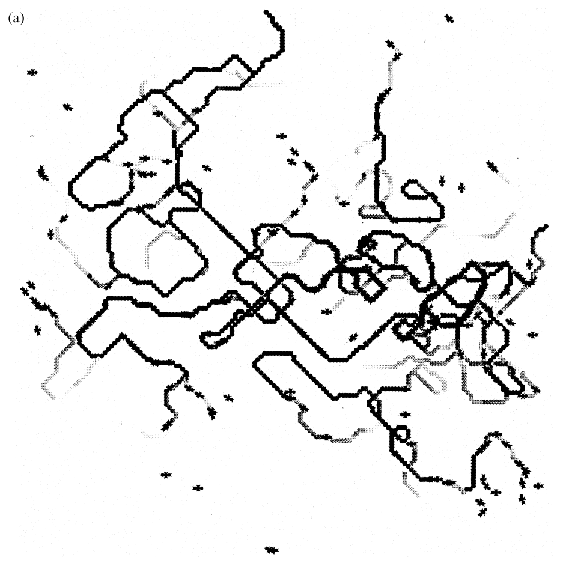
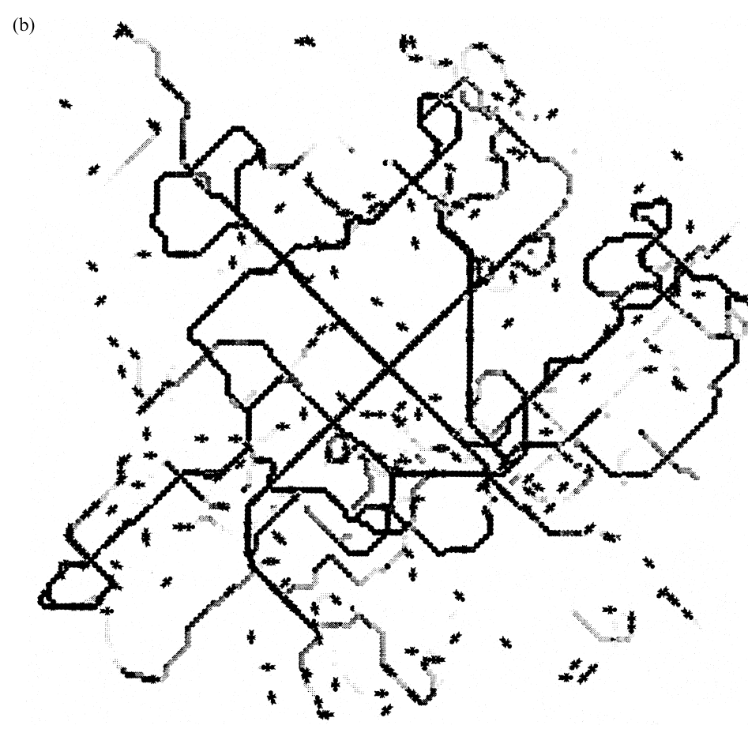
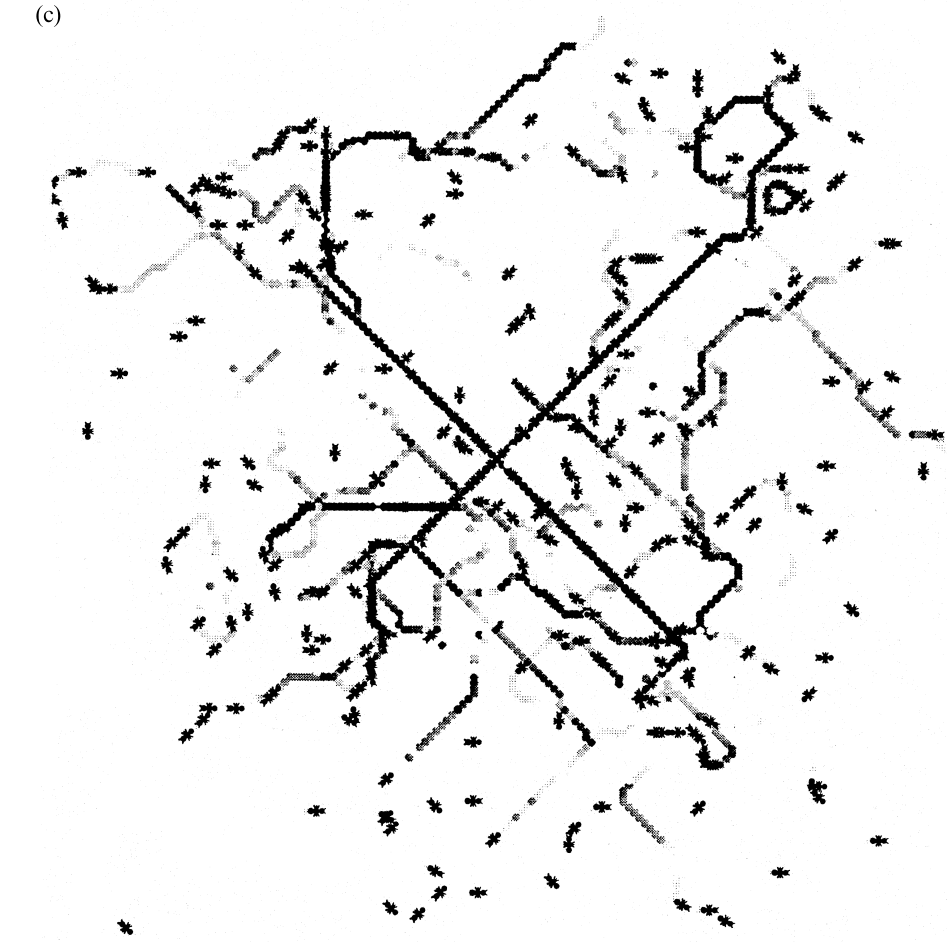
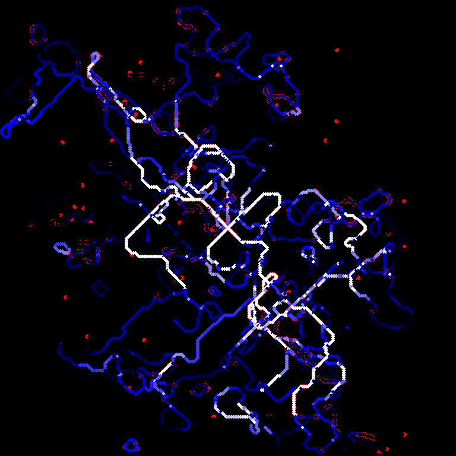
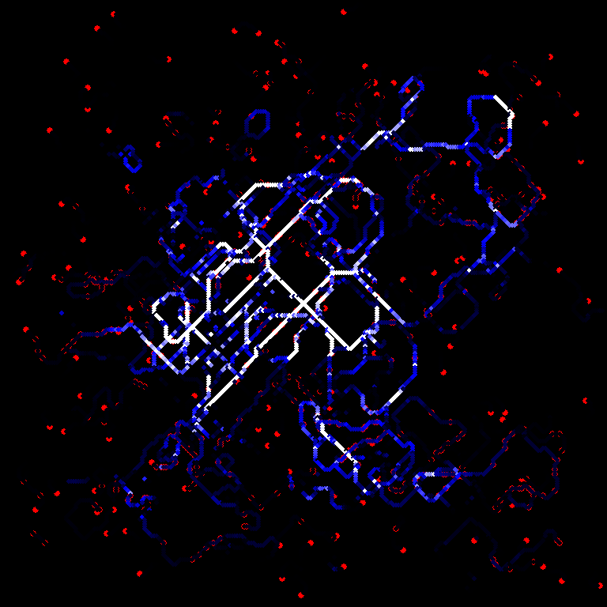
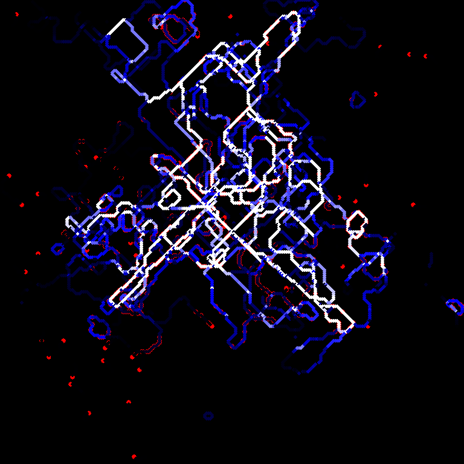

# Project 1: ANTS!
**Author**: Dhvan Shah

**Paper**: Watmough, J. & Edelstein-Keshet, L. (1995). *"Modelling the Formation of Trail Networks by Foraging Ants"*

## Project Overview
This project implements an Agent Based Model to simulate the formation of trails by foraging ants. The simulation explores how simple, local interactions allow a colony to solve complex pathfinding problems without a centralized controller

The main requirement was to replicate **Figure 3** from the source paper, demonstrating the *straightness* of an ant network is inversely related to an individual ant's "fidelity" to the pheromone signal.

### Scientific Background
The model relies on three governing rules derived from the paper:
1. **Pheromone Deposition**: Ants deposit a fixed amount of pheromone at their current location
2. **Evaporation**: Pheromone trails decay linearly over time, creating a feedback loop where only reinforced trails survive
3. **The Fork Algorithm**: When sensing a trail, ants make decision based on these rules:
    - If the trail continues straight, the ant will follow the trail
    - If the trail splits, the ant will follow the stronger branch
    - If the branches are equal, the ant will move as if it was exploring

## Benchmark
The primary objective was to replicate **Figure 3** from the source paper. 

### Benchmark Metrics
1. **Visual**: A distinct "X" pattern emerging from the center
2. **Follower-to-Lost Ratio**: A measure of network efficiency

### Figure 3.a


**Fidelity:** 255 / 256

**Number of Follower Ants:** 468

**Number of Lost Ants:** 32

**F-L Ratio:** 14.625

### Figure 3.b


**Fidelity:** 251 / 256

**Number of Follower Ants:** 396

**Number of Lost Ants:** 89

**F-L Ratio:** 4.449

### Figure 3.c


**Fidelity:** 247 / 256

**Number of Follower Ants:** 297

**Number of Lost Ants:** 91

**F-L Ratio:** 3.264

## Replication

To mitigate the randomness in the model and obtain usable data, I ran the simulation 10 times for each case and averaged the `F / L` ratios. The images below show the runs that most closely matched the paper's benchmark. All other screenshots are archived in the `runs/case<1,2,3>` folders.

### Case 1



**Fidelity:** 255 / 256

**Average Number of Follower Ants:** 731.1

**Average Number of Lost Ants:** 49.4

**Average F-L Ratio:** 15.150

### Case 2



**Fidelity:** 251 / 256

**Average Number of Follower Ants:** 483.6

**Average Number of Lost Ants:** 134.0

**Average F-L Ratio:** 3.628

### Case 3


**Fidelity:** 247 / 256

**Average Number of Follower Ants:** 381.9

**Average Number of Lost Ants:** 181.7

**Average F-L Ratio:** 2.122

## Initial Burst Hypothesis
While implementing this model, I encountered a significant discrepancy between the paper's text description and its visual results. This required straying from the literal instructions to accurately reproduce the papers results. 

### The Discrepancy
The paper states that ants are released "at a rate of one per iteration"
- At *t = 1500*, a rate of 1 ant per tick implies around 1500 ants (minus boundary losses)
- The caption of figure 3 clearly states that only around 500 ants remained at *t = 1500*
- Running the simulation with strictly 1 ant per tick results in an overcrowded grid. The sheer volume of new agents drowns out the pheromone signals, not only preventing the delicate "X" pattern from appearing within the 1500-step limit, but also resulting in completely different numbers for follower and explorer ants. 
- Whilst the F-L Ratio might still be the same, this discrepancy required some tweaking to the model in order to get the output to match figure 3

### Solution
I hypothesized that the authors of the papers likely primed their grid with a set number of ants. To test this, I implemented an optional Burst mode, where the first tick sends out 120 ants as opposed to just 1. 

To empirically verify the necessity of the "Initial Burst" and population control, I conducted three distinct experiments. All experiments utilized the following fixed parameters to isolate the variables of population injection and timing.

**Fixed Parameters:**
* **Fidelity:** 255 / 256 (High Fidelity)
* **Deposition Rate:** 8 units/step
* **Evaporation Rate:** 1 unit/step
* **Simulation Duration:** 1500 Timesteps
* **Random Seed:** "Dhvan Shah"

### Summary of Results

| Experiment | Configuration | F/L Ratio | Followers | Lost Ants |
| :--- | :--- | :--- | :--- | :--- |
| **A** | No Burst (Standard) | 18.27 | 1078 | 59 |
| **B** | Burst (No Limit) | 25.41 | 1169 | 46 |
| **C** | **Burst + Limit** | **18.97** | **683** | **36** |

---

### Experiment A: Control
*Releasing 1 ant per tick, continuous for 1500 steps.*


**Observation:** The high population density (Total: 1137 ants) creates a crowded network. While a pattern emerges, the sheer volume of Lost ants constantly exploring creates noise around the main trunk lines.

**Statistics:**
- **F/L Ratio:** 18.271
- **Followers:** 1078
- **Lost:** 59


### Experiment B: Initial Burst (No Spawning Limit)
*Burst of 120 ants at t=0, followed by 1 ant/tick for 1500 steps.*



**Observation:** Adding a burst massively increases the follower count. The existing trails are heavily reinforced by the initial wave, leading to an artificially high F/L ratio of 25.4. This density far exceeds the visual sparsity seen in the paper's Figure 3.

**Statistics:**
- **F/L Ratio:** 25.413
- **Followers:** 1169
- **Lost:** 46

---

### Experiment C: Burst with Population Control (The Fix)
*Burst of 120 ants at t=0, spawning stops at t=1000.*


**Observation:** This configuration yields the closest match to the paper. By stopping the influx of new ants at t=1000, the population stabilizes at ~720 agents. The trail network is distinct, the "X" pattern is clear, and the F/L ratio (18.97) reflects a mature, stable system rather than a chaotic one.

**Statistics:**
- **F/L Ratio:** 18.972
- **Followers:** 683
- **Lost:** 36

## Capabilities
- **Variable Fidelity**: Can simulate high vs. low fidelity systems by adjusting `FIDELITY` in `config.py`
- **Scientific Validation**: Includes unit tests `tests/` that verify the fork algorithm and deposition logic (amongst other edge case tests) as specified in the paper
- **Real-Time Visualization**: Uses `Pygame` to render ants and pheromone trails at 60FPS

## Limitations
- **Burst Model**: The model assumes the source paper omitted an initial burst of agent. This variation was necessary to match the visual density of the benchmark
- **Grid Size**: The current implementation is optimized for the paper's 256x256 grid. Performance degrades significantly at grid sizes above 512x512, requiring further optimization
- **Color Scale**: The pheromone visualization requires manual tuning of the color scale threshold to match the high-contrast look of the source paper, mirroring the saturation challenges mentioned by the authors

## File Structure
- `main.py`: Simulation loop. Handles time-stepping, evaporation and spawning
- `ant.py`: Agent logic. Contains crucial `move()`, `turn()`, `check_for_trail()` methods
- `gui.py`: Visualization. Maps pheromone concentration to a blue gradient, and displays ants as red circles
- `config.py`: Central control file for most scientific parameters
- `tests/`: Unit tests validating logic

## Usage

### Requirements
* **Python 3.12+**
* Install dependencies:
    ```bash
    pip install -r requirements.txt
    ```
    
### Reproducing Figure 3a
To replicate the benchmark "X" pattern and F/L ratio:

1.  Open `config.py`.
2.  Set the fidelity parameter:
    ```python
    FIDELITY = 255
    ```
3.  *(Optional)* Set or unset `RANDOM_SEED` for reproducibility.
4.  Run the simulation:
    ```bash
    python main.py
    ```
5.  The **F-L Ratio** will print to the terminal upon completion (1500 timesteps).

### Running Unit Tests
To verify the scientific logic and boundary conditions:
```bash
pytest